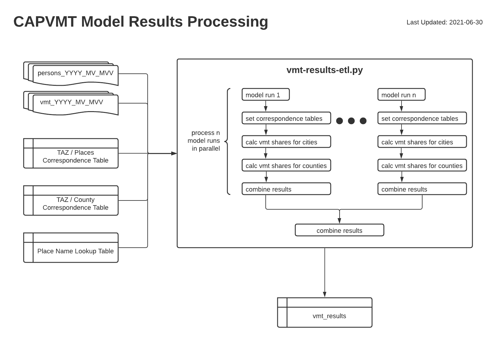

# Processing Model VMT Data
The process described here takes various inputs (travel model outputs and correspondence tables), processes them through a single Python script, and produces a `vmt_results` table that can then used in the CAPVMT web application. 

View this diagram on [Lucid Charts](https://lucid.app/lucidchart/invitations/accept/inv_bc054da4-9c57-4e8b-a732-eb8aa6a4ccab).

## Inputs

### Model Outputs
- `persons_YYYY_MV_MVV` and `vmt_YYYY_MV_MVV`: These are outputs from the travel model and are also known as `AutoTripsVMT_personsHomeWork.csv` and `AutoTripsVMT_perOrigDestHomeWork.csv` respectively. The script `copy_model_output.sh` provides an automated way to copy these files directly from the model directory folder. For further information about these model outputs, please view their documentation here: https://github.com/BayAreaMetro/travel-model-one/tree/master/utilities/VMT%20Shares

### Correspondence Tables
- `TAZ / Places Correspondence Table`: This is a correspondence table that matches place id's (typically cities) to strings that contain a comma separated list of TAZ in that place id.
- `TAZ / County Correspondence Table`: This is a correspondence table that matches county id's to strings that contain a comma separated list of TAZ in that county.
- `Place Name Lookup Table`: This is a table that matches a place or county id to the name of that place or county. 

## Processing Script
The single script `vmt-results-etl.py` performs all processing operations. The script processes each model run in parallel to decrease runtime. The script should take approximately 15 - 20 minutes to to process 6 model run scenarios. 

This Python script replaces a series of SQL scripts that were used in previous years to perform this processing task. The SQL scripts were rewritten into Python for improved performance, readability, and maintainability. The following SQL scripts are replaced by this single Python script:
1. `vmtshares.sql`
2. `update_vmtresults_table_2017.sql`
3. `main_views.sql`
4. `update_model_name_suffix.sql`

## Outputs
The `vmt_results` output from this script contains a table that can be copied into a database and queried by the CAPVMT web application. It contains, for each place (i.e. city or county), the VMT associated with that place split based on live/work location, and whether the VMT is calculated inside, partially inside, or outside the place area.
